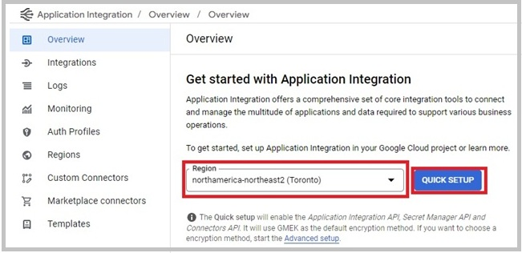
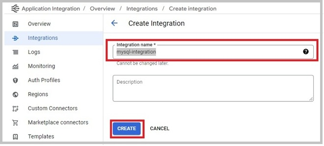

# Milestone 2:  Data Storage and Integration Connectors

## Objective:
* Get familiar with Docker images and containers.
* Deploy tabular and key-value data storage using Google Kubernetes Engine (GKE).
* Get familiar with key-value data storage.
* Create and configure connectors from Google Pub/Sub to MySQL server.
* Create and configure connectors from Google Pub/Sub to Redis server.

## Repository:
[https://github.com/zubxxr/SOFE4630U-MS2](https://github.com/zubxxr/SOFE4630U-MS2)

## Table of Contents

- [Introduction](#introduction)
- [Setting Up Google Kubernetes Engine](#setting-up-google-kubernetes-engine)
- [Deploy MySQL using GKE](#deploy-mysql-using-gke)
- [Deploy Redis using GKE](#deploy-redis-using-gke)
- [Create a Pub/Sub Sink Connector to MySQL Server](#create-a-pubsub-sink-connector-to-mysql-server)
  - [1. Create an Integration Connectors to The MySQL Server](#1-create-an-integration-connectors-to-the-mysql-server)
  - [2. Prepare the MySQL Server and the Pub/Sub Topic](#2-prepare-the-mysql-server-and-the-pubsub-topic)
  - [3. Set Up Application Integration](#3-set-up-application-integration)
  - [4. Test the Integration and Publish It](#4-test-the-integration-and-publish-it)
  - [5. Using MySQL Connector with Python Script](#5-using-mysql-connector-with-python-script)
  - [6. Clean Up (Important)](#6-clean-up-important)
- [Create a Pub/Sub Sink Connector to The Redis Server](#create-a-pubsub-sink-connector-to-the-redis-server)
  - [1. Create an Integration Connectors to The Redis Server](#1-create-an-integration-connectors-to-the-redis-server)
  - [2. Create the Pub/Sub Topic](#2-create-the-pubsub-topic)
  - [3. Set Up Application Integration](#3-set-up-application-integration-1)
  - [4. Test the Integration and Publish It](#4-test-the-integration-and-publish-it-1)
  - [5. Using MySQL Connector with Python Script](#5-using-mysql-connector-with-python-script-1)
  - [6. Cleaning Up (Important)](#6-cleaning-up-important)
- [Final Cleaning Up (Optional)](#final-cleaning-up-optional)
- [Discussion](#discussion)
- [Design](#design)
- [Deliverables](#deliverables)


## Introduction:
1. The video shows a case study of containerization in DevOps. The concept of Docker containerization is used extensively in the cloud world. Watch the video to familiarize yourself with [Docker](https://youtu.be/rOTqprHv1YE) terminologies. 
2. We will use Kubernetes (**K8s**) to manage Docker images and applications. The following video covers [Kubernetes and its components](https://youtu.be/cC46cg5FFAM).
3. Kubernetes will be used to deploy both The MySQL and Redis servers. Watch the first **7:45 minutes** in the following video to get familiar with [Redis commands](https://youtu.be/jgpVdJB2sKQ).
4. ~~Kafka has an existing tool to automatically store into data storage the data published into a topic. This tool is called Kafka Connect. Watch the following video for more information about [Kafka Connect](https://www.youtube.com/watch?v=Lmus2AFX-oc).~~
5. We will create a similar tool within GCP in this lab. However, we will focus on the sink connectors, It's possible to create a source connector as well.

## Setting Up Google Kubernetes Engine
To set up Google Kubernetes Engine (**GKE**), open the console of the project you have created within the Google Cloud Platform (GCP) during the first milestone.
1. Set the default compute zone to **northamerica-northeast1-b**
   
   ```cmd
   gcloud config set compute/zone northamerica-northeast1-b  
   ```
    
2. Enable GKE by searching for **Kubernetes Engine**. Select **Kubernetes Engine API**. Then, click **Enable**.
   
   
   
3. Wait until the API is enabled. Then, create a three-node cluster on GKE called **sofe4630u**. A Node is a worker machine in which docker images and applications can be deployed.
   
   ```cmd
   gcloud container clusters create sofe4630u --num-nodes=3 
   ```
      
   **Note**: if the authorization windows pop up, click Authorize
   
   **Note**: if you get an error that there are no available resources to create the nodes, you may need to change the default compute zone (e.g., to **us-central1-a**) or reduce the number of nodes.

## Deploy MySQL using GKE:
1. We will use a YAML file to deploy a pre-created MySQL image over the GKE cluster. A YAML file contains the configuration used to set the deployment. The deployment's role is to orchestrate docker applications.

   1. Clone the GitHub repository
       
      ```cmd 
      cd <your-working-directory>
      git clone https://github.com/zubxxr/SOFE4630U-MS2.git
      ```
        
   2. Run the following command to deploy the MySQL server
      
      ```cmd 
      cd <your-working-directory>/SOFE4630U-MS2/mySQL
      kubectl create -f mysql-deploy.yaml
      ```
        
      The command will deploy the configuration stored in the [mysql-deploy.yaml](/mySQL/mysql-deploy.yaml) into GKE. It would pull the **mysql/mysql-server** Docker image and deploy and enable the **3306** port number to allow access from the outside world. The file **mysql-deploy.yaml** is used to configure the deployment. It's shown in the following figure and can be interpreted as:
      
         * **Indentation** means nested elements
      
         * **Hyphen** means an element within a list
      
         * **First two lines**: indicate the YAML file type and its version.
      
         * **Line 4**: provides a name for the deployment.  Kubernetes will use this name to access the deployment.
      
         * **Line 6**: indicates that only a single pod will be used.
      
         * **Line 9**: provides the name of the application that the pod will access.
      
         * **Line 16**: provides the ID of the Docker image to be deployed.
      
         * **Lines 19-24**: define image-dependent environment variables that define the username/password (**usr/sofe4630u**), and a schema (**Readings**).
      
         * **Line 26**: defines the port number that the image will use.
      
                  
   
   3. The following command can check the status of the deployment
      
      ```cmd 
      kubectl get deployment 
      ```
      A tip to make it easier is to add the **--watch** argument to the command. You can use this argument for the commands below as well, such as get pods, get service, etc. And if you would like to terminate the command, just press **CTRL+C**.
      
      ```cmd 
      kubectl get deployment --watch
      ```
   5. While the following command can access the status of pods
      
      ```cmd 
      kubectl get pods  
      ```

      check that the deployment is available and that the pod is running successfully (it may take some time until everything is settled down)
      
2. To give the deployment an IP address, a load Balancer service, mysql-service, should be created for that deployment. The load Balancer distributes the requests and workload between the replicas in the deployment  (why this is not important in our case?) and associates an IP to access the deployed application.
   
   1. The load Balancer service configuration is included in the [mysql-service.yaml](/mySQL/mysql-service.yaml) file from the cloned repo.
      
      ```cmd 
      cd <your-working-directory>/SOFE4630U-MS2/mySQL
      kubectl create -f mysql-service.yaml
      ```
      
      The essential lines in the mysql-service.yaml file is:
      
         * **Line 8**: the port number assigned to the external IP.
           
         * **Line 10**:  the name of the application that the service will target.
     
                  
   
   2. To check the status of the service, use this command.
      
      ```cmd 
      kubectl get service 
      ```
   
            
   
      It may take some time until the external IP address is changed from pending to a valid IP address.
      
3. To access the MySQL using the IP address,

   1. Run the following commands from any device where the MySQL client is installed (or the GCP console). Before running the command, replace the <IP-address> with the external IP obtained from the previous step. The options **-u**, **-p**, and **-h** specify the deployed server's username, password, and host IP, respectively.
      
      ```cmd
      mysql -uusr -psofe4630u -h<IP-address>
      ```
   2. Try to run the following SQL statements to create a table, create three records, and search the table.
      ```sql
      use Readings; 
      create table meterType( ID int primary key, type varchar(50), cost float); 
      insert into meterType values(1,'boston',100.5); 
      insert into meterType values(2,'denver',120); 
      insert into meterType values(3,'losang',155); 
      select * from meterType where cost>=110; 
      ```
   3. Exit the MySQL CLI, by running
      ```sql
      exit
      ```
   5. (**optional**) After creating a video for submission, you can delete the deployment by using the following command (**Don’t run it right now**)
       ```cmd
      kubectl delete -f mysql-deploy.yaml
      kubectl delete -f mysql-service.yaml
      ```  
## Deploy Redis using GKE:

1. The deployment and the load balancer service are in the same file. To deploy both to GKE, run the following commands 

   ```cmd
   cd <your-working-directory>/SOFE4630U-MS2/Redis
   kubectl create -f redis.yaml
   ```

   Check the status of deployment, service, and pod. Note that the password is set within the YAML file to **sofe4630u**.
   
2. Get Redis external IP.
   
   ```cmd
   kubectl get services
   ```
   
   
   
3. To access the Redis datastore,
   1. To access the Redis server, install the Redis client on your machine. Fortunately, it's installed in the GCP and can be accessed from the console.
      
   2. Log in the to Redis server from the GCP console using the command after replacing the **\<Redis-IP\>** with the IP obtained in step 2 and **sofe4630u** for the password.
      
      ```cmd
      redis-cli -h <Redis-IP> -a sofe4630u
      ```
      
   3 Try to run the following commands. **Note**: there are 16 different databases to select within Redis. The first command selects the first database (0). What are the functions executed by other commands? 
      ``` cmd
      select 0
      set var 100
      get var
      keys *
      del var
      keys *
      ```
   4. Finally, to exit the command line interface, type

      ```cmd
      exit
      ```

4. To access Redis using Python code,
   
   1. Install its library on your local machine (or GCP console) 

      ``` cmd
      pip install redis
      ```
      
   2. In the cloned Github at path [/Redis/code/](/Redis/code/), there are two Python files and a JPG image.
      
      * **SendImage.py**, will read the image **ontarioTech.jpg** and store it in Redis associated with a key **"OntarioTech"** at database 0.
        
      * **ReceiveImage.py**, will read the value associated with the key **"OntarioTech"** from the Redis server and save it into **received.jpg** image.
        
      * Set the Redis Server IP in the second line in **SendImage.py** and **ReceiveImage.py**.
        
      * Run **SendImage.py**, then check the keys in the Redis server. Finally, run **ReceiveImage.py** and check that the **received.jpg** image has been created.

## Create a Pub/Sub Sink Connector to MySQL Server
The sink connector is a service that automatically consumes from a topic(s) and stores the consumed messages in a data storage, as shown in the following figure.

   
   
### 1. Create an Integration Connectors to The MySQL Server

   Integration Connectors provide a transparent, standard interface to connect to various data sources from your integrations. As an integration developer, you can quickly connect to a growing pool of applications and systems without the need for protocol-specific knowledge or custom code.
      
   1. Search for **Connectors** and choose **Connections / Integration Connectors**.

      
         
   2. For the first time, click **SET UP INTEGRATION CONNECTORS**.
         
      
         
   3. Click The **SET UP INTEGRATION CONNECTORS** button and click **ENABLE APIS". Wait until the API is enabled. Then, click **Done**.

      

   4. Click **CREATE NEW CONNECTION**

      
         
      1. Choose The location to be **northamerica-northeast2 (Toronto)**. Then, click **NEXT**.
         
            
         
      2. In the **connection Details**, search for **MySQL** for the **connector** type. Set the **Connection Name** to **mysql-connector** and the **Database Name** to **Readings** (check mysql-deploy.yaml). Leave everything else by its default value. Then, click **NEXT**.

         
         
      3. For the **destination**, set The MySQL IP address obtained in the **host 1** text box and **3306** in the **port 1** text box.

         
         
      4. For the credentials, set **usr** as the MySQL **Username**. For the **password**, you have to **Create New Secret**. Name it **mysql-password**. Set its value to **sofe4630u**. (MSQL username and password can be found in mysql-deploy.yaml)
         
         
   
      5. Grant any Necessary roles. Then Click **NEXT**.
         
         

      6. Finally, review the summary and click **CREATE**.
      7. Wait until the connector status changed to **Active**
      8. Click on the newly created connector.  
         
      
      9. Click **Edit**.  
         
      
      10. Change the **Max Number of Nodes** to 2, scroll down, and click **Save**.  
            
          


### 2. Prepare the MySQL Server and the Pub/Sub Topic
   1. Login to the MySQL server
      
      ```cmd
      mysql -uusr -psofe4630u -h<IP-address>
      ```
      
   2. Create a table to store the Smart Meter records.

      ```sql
      use Readings; 
      create table SmartMeter( ID int primary key, time bigint, profile_name varchar(100), temperature double, humidity double, pressure double); 
      ```
      
   3. Exit the MySQL CLI.

      ```sql
      exit
      ```
      
   4. Create a new topic and name it **smartMeterReadings** as you did in the first milestone.
      
### 3. Set Up Application Integration
Application Integration offers a comprehensive set of core integration tools to connect and manage various applications (Google Cloud services and third-party SaaS) and data required to support multiple business operations. This includes Google Pub/Sub, MySQL, and Redis. It's configured as a plug-and-play tool. The source of the data that starts the integration is called the trigger, while the destination and other temporary processes are called tasks.

   1. Search  for **Application Integration**.

      
      
   2. For the first time, choose the region **northamerica-northeast2 (Toronto)**. Then, click **QUICK SETUP** to enable the required APIs.

      

   3. Click **Create Integration**.

      
      
   4. Name The integration **mysql-integration**. Then, click **Create**.

      

      ---
      
      ### Note
      > **⚠️ Important:** This error may show up when using Firefox. Switch to Google Chrome, and it should start working.
      >
      > 


   5. From the **triggers** dropdown menu, choose **Cloud Pub/Sub**. A box named **Cloud Pub/Sub Trigger** should appear. Place it in the design area.

      
      
   6.	Click the **Cloud Pub/Sub Trigger** box to display the properties. Set the Pub/Sub topic text box with the full path of the topic. It should be in the following format: **projects/<project_id>/topics/<topic_id>**. **Note**: you can copy the full path of the topic from the Cloud Pub/Sub topics page. Fill the **Service account** textbox with the Service account you created in the first milestone with the Two Pub/Sub roles. Finally, click the **GRANT** button to fix any missing role within the service account.

     	

   7. From the **TASKS** dropdown menu, select **CONNECTORS**. Then, choose the **mysql-connector**. Place the **mysql-connector** box in the design area.
      
   8. Click the **mysql-connector** box. Then, click the **CONFIGURE CONNECTOR**
      
      
   
   9. Set the configuration, as shown in the figure, in three steps:
       * Leave the default values in the first step.
       * In the second step, select **entities** to select a table.
       * In the last step, set the table name, **SmartMeter**, as the **Entity**, and **Create** as the operation. The creation operation will insert new records into the table according to its primary key (**ID**).

      
      
   10. The format of the topic messages is incompatible with the format accepted by the MySQL connector. Drag and drop a **Data Mapping** box from the **TASKS** dropdown menu to make them compatible. Connect the different boxes as shown in the following figure.
       
       
   11. Select the **Data Mapping** box and click **OPEN DATA MAPPING EDITOR**. Drag and drop the **CloudPubSubMessage.data** as input and **connectorInputPayload \(mysql-connector\)** as output. Thus, only the **data** field will pass from the Pub/Sub into the MySQL connector.
       
       
   
### 4. Test the integration and publish it
1. To test the integration, we will get access to the Cloud Pub/Sub output from the interface by
   * Click the **Cloud Pub/Sub Trigger** box.
     
   * Scroll down to **Trigger Output Variables**.
     
   * Edit the **CloudPubSubMessage** variable.
     
      
     
   * Change the **Variable Type** to **Output from Integration**. Thus, we can test the integration by manually setting this variable.
  
      

   * Save Variable.
     
2. Click on the **Cloud Pub/Sub Trigger** box. Click **Test** at the top and type the following JSON value into the **CloudPubSubMessage** textbox. This JSON file is the minimal subset of the JSON value produced from the Pub/Sub. You can find here [the format of the Pub/Sub messages](https://cloud.google.com/pubsub/docs/publisher#using-attributes). **Note**: as the **Create** operation configures the MySQL connector, you can't insert a record with an ID that already exists in the table.
  
   ```JSON
   { "data": "{\"ID\":-1, \"profile_name\":\"test\", \"temperature\":50, \"humidity\":60, \"pressure\": 1.0, \"time\": 1253145}"}
   ```

   
   
4. To check the success of the integration, we will display the **SmartMeter** table
   1. Log into the MySQL CLI.
      
      ```cmd
      mysql -uusr -psofe4630u -h<IP-address>
      ```
      
   2. display the **SmartMeter** table. You will see a entry in the table, with an ID of **-1**.

      ```sql
      use Readings; 
      select * from SmartMeter; 
      ```
      
   3. Exit the MySQL CLI, by running
      ```sql
      exit
      ```

5. To be able to use the integration, you have to publish (deploy) it first by click to the **publish** button.

   
   
### 5. Using MySQL Connector with Python Script 
* In the folder [/MySQL-connector](/MySQL-connector) within the reposaitory, there is a python script code under the name **smartMeter.py**. The script is similar to the one used in the first milestone. The only difference is it publishes to the **smartMeterReadings** topic. As usual,
   * Download the script to your computer.
   * Set the project ID to variable at line 15.
   * move the JSON key for the service account to the same directory as the **smartMeter.py** file
* run the **smartMeter.py** script.
* Check the table within the MySQL server to check that the integration is working.

### 6. Clean up (important)

It's required to <ins><b>unpublish</b></ins> the **mysql-integration** integration as it will consume your credit quickly.
Also, <ins><b>Suspend</b></ins> the **mysql-connector** 

## Create a Pub/Sub Sink Connector to The Redis Server
This will be similar to the MySQL. Thus, a high-level instruction is given. One of the differences is that key/value pairs are needed. Those will be mapped to the Pub/Sub message's data and key.


   
### 1. Create an Integration Connectors to The Redis Server

   1. Search for **Connectors** and choose **Connections / Integration Connectors**.
      
   2. Click **CREATE NEW**
      1. Choose The location to be **northamerica-northeast2 (Toronto)**.
      2. Click **NEXT**.
      3. Search for **Redis** for the **connector** type in the **Connection Details**. Set the **Connection Name** to **redis-connector**. Leave everything else by its default value.
      4. Click **NEXT**.
      5. For the **destination**, set The Redis IP address obtained in the **host 1** text box and **6379** in the **port 1** text box.
      6. within the credentials step, select **User Password**. To create the **password**, select **Create New Secret**. Name it **redis-password** and set its value to **sofe4630u** (check the edis.yaml file).
      7. Grant any Necessary roles. Then Click **NEXT**.
      8. Finally, review the summary and click **CREATE**.
      9. Wait until the connector status changed to **Active**
      10. Similarly to the MySQL connector, change the number of nodes for **redis-connector** to **2**.
    
### 2. Create the Pub/Sub Topic

Create a new topic and name it **Image2Redis**, as you did in the first milestone.

### 3. Set Up Application Integration
   1. Search  for **Application Integration**.
   2. Click **Create Integration**.  
   3. Name The integration **redis-integration**. Then, click **Create**.
   4. From the **triggers** dropdown menu, choose **Cloud Pub/Sub**. A box named **Cloud Pub/Sub Trigger** should appear. Place it in the design area.
   5.	Click the **Cloud Pub/Sub Trigger** box to display the properties. Set the Pub/Sub topic text box with the full path of the topic. It should be in the following format: **projects/<project_id>/topics/<topic_id>**. **Note**: you can copy the full path of the topic from the Cloud Pub/Sub topics page. Fill the **Service account** textbox with the Service account you created in the first milestone with the Two Pub/Sub roles. Finally, if shown up, click the **GRANT** button to fix any missing role within the service account.
   6. From the **TASKS** dropdown menu, select **CONNECTORS**. Then, choose the **redis-connector**. Place the **redis-connector** box in the design area.
   7. Click the **redis-connector** box. Then, click the **CONFIGURE CONNECTOR**
   8. Set the configuration as 
       * Leave the default values in the first step.
       * In the second step, select **Entity** to select a table.
       * In the last step, set **Keys** as the **Entity** and **Create** as the operation.
   9. To make the format of the topic messages compatible with the format accepted by the Redis connector. Drag and drop a **Data Mapping** box from the **TASKS** dropdown menu to make them compatible. Connect the different boxes as shown in the following figure.

       
       
   10. Select the **Data Mapping** box and click **OPEN DATA MAPPING EDITOR**. Finally, the data will be mapped, as shown in the following figure.
       
       
   
### 4. Test the integration and publish it
    
1. Click on the design area to enable the test button. Click **test** and type the following JSON value into the **CloudPubSubMessage** textbox.

   ```JSON
   { "data": "1234","orderingKey": "test" }
   ```
   
4. To check the success of the integration, we will check the key within the Redis storage
   1. Log into the Redis CLI.
      
      ```cmd
      redis-cli -h <Redis-IP> -a sofe4630u
      ```
      
   2. Try to run the following commands to get the.

      ```sql
      select 0
      get test
      ```
      
   3. Exit the Redis CLI by running
      ```sql
      exit
      ```

5. To use the integration, you have to publish (deploy) it first by clicking the **publish** button.

   
   
### 5. Using MySQL Connector with Python Script 
* In the folder [/Redis-connector](/Redis-connector) within the repository, the **produceImage.py** script reads the **ontarioTech.jpg** image, serializes it to base64, and publishes it to the **Image2Redis** topic. As usual,
   * Download the whole folder to your computer.
   * Set the project ID to variable at line 15.
   * move the JSON key for the service account to the same directory.
* Run the **produceImage.py** script.
* To check the success of the integration, the **ReceiveImage.py** script will access the Redis server, get the value associated with the key, **image**, deserialize it, and save it in the same folder by the name **recieved.jpg**.
   * Set the IP of the Redis server in the 5th line
   * Run the **ReceiveImage.py** script.
* Finally, check the **received.jpg** and compare it with the **ontarioTech.jpg** image.
### 6. Cleaning up (important)

It's required to <ins><b>unpublish</b></ins> the **redis-integration** integration as it will consume your credit quickly.
Also, <ins><b>Suspend</b></ins> the **redis-connector** 

## Final Cleaning up (optional)

you can delete the deployment and the services of the MySQL and Redis servers by executing 

```cmd
cd <your-working-directory>/SOFE4630U-MS2/mySQL
kubectl delete -f mysql-deploy.yaml
kubectl delete -f mysql-service.yaml
cd <your-working-directory>/SOFE4630U-MS2/Redis
kubectl delete -f redis.yaml
```

## Discussion: 
* What's the different of Source and Sink connectors?
* What's the applications of the connectors?

## Design: 
We will contine using the same dataset used in the first milestone. However, we will use the Whole dataset, not only the CSV file. The dataset:
* can be accessed from  [https://github.com/GeorgeDaoud3/SOFE4630U-Design](https://github.com/GeorgeDaoud3/SOFE4630U-Design)
* contains a folder, **Dataset_Occluded_Pedestrian**, of images
* contains the **Labels.csv** file, you used in the first milestone.

You needed to 
* create two topics one for the records of the CSV file and the other for the images.
* Deploy a MySQL server and create an empty table within it to accomidate the records of the CSV file.
* Create an application integration to automatically store the records published in the topic into the MySQL database.
* Use the same script, we written in the first milestone to publish the messages into the topic.
* Deploy a Redis server to store the images.
* Create an application integration to automatically store the images published in the other topic into the Redis datastorage.
* Write a python script that will publish the images to the topic. The script should
   * Read search for all the images in the folder.
   * For each image
      * Read the image.
      * Serialize it.
      * Publish the message into the topic using the image name as the message key and the serialized image as the message value.


# Deliverables
1. A GitHub link to the scripts used in the Design part.
2. A report that includes the discussion and the design parts.
3. An audible video of about 5 minutes showing the configuration, execution and outputs of the MySQL sink connector, and Redis Connectors. 
4. An audible video of about 5 minutes showing the design part. The video should include proofs of the successful integration of the Cloud Pub/Sub with the connectors.

Put the GitHub link and video links inside your report, and submit the report.
